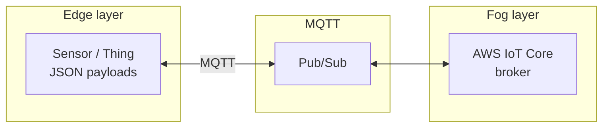

# Edge ↔ Fog (AWS IoT Core) — reference architecture

This matches the lab-style diagram: **sensor (Thing) generates JSON**, **pub/sub over MQTT**, and **AWS IoT Core acts as the broker** in the fog layer.

| Layer | Role |
|--------|------|
| **Edge** | Devices publish validated sensor JSON (single reading, `{ readings: [...] }`, or a JSON array). |
| **MQTT** | Transport; topics can be hierarchical (`library/...`) or a single data topic (`sensors/mock-sensor-001/data`). |
| **Fog** | In this project: **AWS IoT Core** receives publishes; the **ThermoSentinel fog node** subscribes, aggregates, and forwards to the cloud HTTP ingest (and optionally SQS / MQTT out). |

Implementation details: **`docs/AWS_IOT_CORE.md`** (policies, `mock-sensor-001`, `SensorPublishPolicy`).
